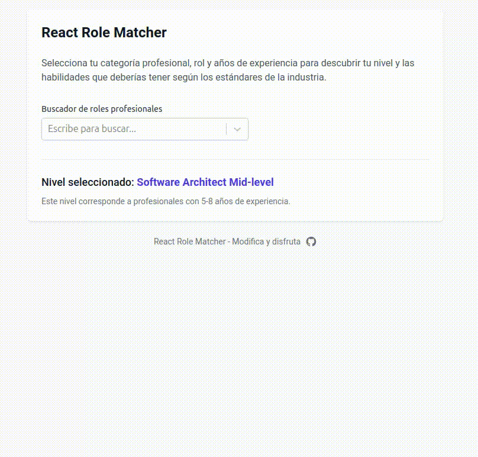
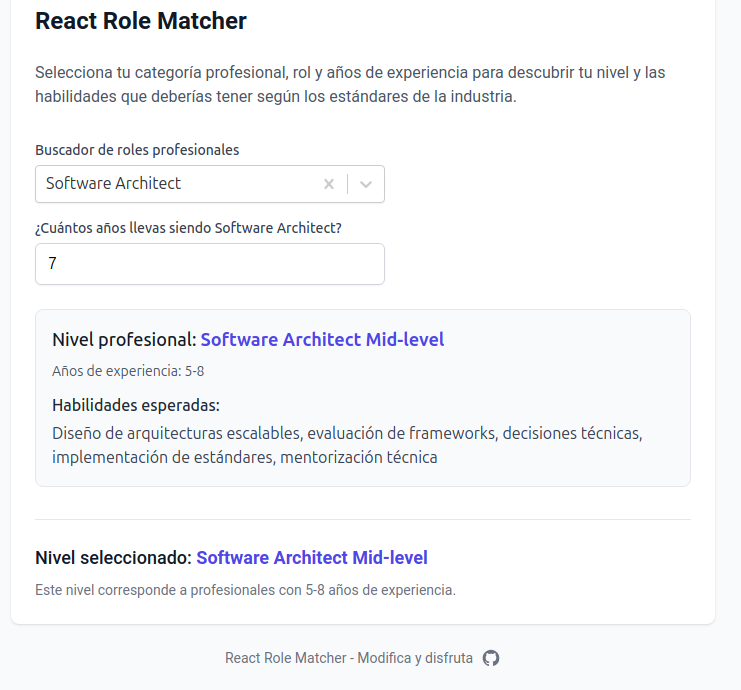
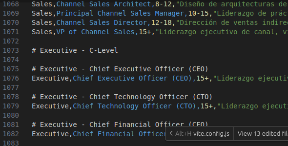

# React Role Matcher

<div align="center">
  
</div>


Un componente React para autocompletar roles profesionales y mostrar expectativas basadas en años de experiencia, ideal para aplicaciones de desarrollo profesional y definición de perfiles. 

> **IMPORTANTE**: Este componente incluye un extenso diccionario CSV con **1163 registros** de roles profesionales organizados en 11 categorías y 9 niveles de experiencia, desde Trainee hasta VP/Chief. El archivo se encuentra en `data/roles_profesionales_npm_format.csv` y es fundamental para el funcionamiento del componente.

## Tecnologías Utilizadas

<div align="center">
  
  
  
  
  
</div>

## Instalación

```bash
npm install react-software-role-matcher
# o
yarn add react-software-role-matcher
```

## Características

- 🔍 Buscador con autocompletado para roles profesionales
- 📝 Campo dinámico para años de experiencia
- 📊 Determinación automática del nivel profesional
- 📋 Muestra habilidades esperadas según el nivel y rol
- 📂 Incluye un CSV completo con más de 1000 roles profesionales y sus habilidades

<div align="center">
  
</div>

## Categorías Profesionales

| Categoría | Roles Profesionales |
|------------|---------------------|
| **Software Engineering** | Backend Developer, Frontend Developer, Full-Stack Developer, Software Architect, Tech Lead, Engineering Manager, Mobile Developer, DevOps Engineer, Infrastructure Engineer, SRE, SysAdmin, DBA, QA Engineer, Test Automation Engineer, Security Engineer, MLOps Specialist, Developer Advocate, API Developer, Cloud Engineer, Game Developer |
| **Data** | Data Analyst, Business Intelligence Specialist, Data Engineer, Data Scientist, Machine Learning Engineer, AI Researcher, Data Visualization Specialist, Big Data Engineer, Data Architect, NLP Engineer |
| **Producto** | Product Manager, Product Owner, Project Manager, Delivery Manager, Product Analyst, Lead Product Manager, VP of Product, Technical Product Manager, Growth Product Manager, Innovation Manager |
| **Diseño** | Brand Designer, Graphic Designer, Motion Designer, Layout Designer, UI/UX Designer, UX Writer, UX Researcher, Interaction Designer, Visual Designer, 3D Artist, Service Designer, Lead Designer |
| **Marketing** | Brand Marketing Specialist, Creative Marketing Specialist, Content Marketer, Content Strategist, Copywriter, Marketing Generalist, Growth Manager, Performance Marketer, PR Specialist, Social Media Manager, Community Manager |
| **Sales** | Sales Development Representative, Account Executive, Enterprise Account Executive, Sales Manager, Sales Operations Specialist, Customer Success Manager, Solution Engineer, Sales Engineer, Channel Sales Manager, Regional Sales Director, Chief Revenue Officer |
| **Legal** | Legal Counsel, Compliance Officer, Legal Manager, Contract Manager, IP Specialist, Data Privacy Officer, General Counsel |
| **Operaciones** | Operations Manager, Business Operations Manager, Strategy Consultant, Customer Service Specialist, Support Specialist, Operations Analyst |
| **Finanzas** | Financial Analyst, Accountant, Controller, Finance Manager, CFO, Investment Analyst, Tax Specialist, Auditor |
| **Recursos Humanos** | HR Generalist, Talent Acquisition Specialist, HR Business Partner, Learning & Development Specialist, Compensation & Benefits Specialist, People Operations Manager, HR Manager, Recruitment Specialist, Onboarding Specialist, Organizational Development Specialist |
| **Administración** | Administrative Assistant, Office Manager, Executive Assistant, Facilities Manager, Administrative Coordinator, Virtual Assistant, Front Desk Coordinator, Administrative Director |

<div align="center">
  
</div>

## Niveles Profesionales

Cada rol incluye 9 niveles de experiencia estandarizados con habilidades específicas:

| Nivel | Años de Experiencia | Descripción |
|-------|---------------------|-------------|
| **Trainee** | 0-1 | Profesionales en formación, aprendiendo los fundamentos |
| **Junior** | 0-2 | Profesionales con conocimientos básicos, trabajando en tareas supervisadas |
| **Mid-level** | 2-4 | Profesionales con experiencia, capaces de trabajar de forma independiente |
| **Senior** | 4-7 | Profesionales experimentados, capaces de liderar proyectos y mentorizar |
| **Tech Lead** | 7-10 | Líderes técnicos, responsables de equipos y definición de estándares |
| **Architect** | 8-12 | Arquitectos, responsables del diseño de sistemas complejos |
| **Principal** | 10-15 | Expertos que definen estrategias y prácticas a nivel organizacional |
| **Director** | 12-18 | Directores que gestionan departamentos y definen estrategias a largo plazo |
| **VP/Chief** | 15+ | Ejecutivos que definen la visión estratégica global y lideran la transformación |

> Esta estructura estandarizada se aplica a todas las categorías profesionales, manteniendo una coherencia en la nomenclatura y en los rangos de experiencia.

## Ejemplo de Progresión de Carrera

```csv
Categoría,Rol,Nivel,Años de experiencia,Habilidades
Software Engineering,Software Engineer,Trainee,0-1,"Fundamentos de programación, control de versiones básico, algoritmos simples"
Software Engineering,Software Engineer,Junior,0-2,"Desarrollo de features simples, testing básico, resolución de bugs"
Software Engineering,Software Engineer,Mid-level,2-4,"Arquitectura de componentes, testing avanzado, CI/CD básico"
Software Engineering,Software Engineer,Senior,4-7,"Arquitectura de sistemas, liderazgo técnico, mentoría"
Software Engineering,Software Engineer,Tech Lead,7-10,"Liderazgo de equipos técnicos, definición de estándares, planificación técnica"
Software Engineering,Software Engineer,Architect,8-12,"Diseño de arquitecturas complejas, estrategias técnicas, frameworks corporativos"
Software Engineering,Software Engineer,Principal,10-15,"Liderazgo de prácticas de ingeniería, innovación técnica, consultoría interna"
Software Engineering,Software Engineer,Director,12-18,"Dirección técnica organizacional, estrategia tecnológica, gestión de departamentos"
Software Engineering,Software Engineer,VP/CTO,15+,"Liderazgo ejecutivo técnico, visión estratégica global, transformación digital"
```

## Uso

```jsx
import React from 'react';
import { RoleMatcher } from 'react-software-role-matcher';

// Puedes usar el CSV incluido, una URL o pasar directamente el contenido
const MyComponent = () => {
  // Opcional: Manejar el evento cuando se determina un nivel profesional
  const handleLevelDetermined = (level) => {
    console.log('Nivel profesional determinado:', level);
    // Puedes usar esta información para actualizar el estado de tu aplicación
    // o enviarla a una API para guardar el perfil del usuario
  };

  return (
    <div className="container mx-auto p-4">
      <h1 className="text-2xl font-bold mb-4">Buscador de Roles Profesionales</h1>
      
      <RoleMatcher 
        // Ruta al archivo CSV con los roles profesionales
        csvUrl="/data/roles_profesionales_npm_format.csv" 
        // O puedes pasar el contenido directamente:
        // csvData={tuContenidoCSV}
        // Callback opcional cuando se determina un nivel
        onLevelDetermined={handleLevelDetermined}
        // Clase CSS opcional para personalizar el componente
        className="my-custom-role-matcher"
      />
    </div>
  );
};

export default MyComponent;
```

### Propiedades del componente

| Propiedad | Tipo | Requerido | Descripción |
|-----------|------|-----------|-------------|
| `csvData` | `string` | No* | Datos CSV en formato string |
| `csvUrl` | `string` | No* | URL al archivo CSV |
| `onLevelDetermined` | `function` | No | Callback cuando se determina un nivel profesional |
| `className` | `string` | No | Clase CSS para personalizar el componente |

> *Nota: Debes proporcionar o `csvData` o `csvUrl`. Si proporcionas ambos, `csvData` tiene prioridad.

## Estructura del CSV

### 📂 Ubicación y tamaño del archivo

El componente utiliza un CSV completo con **1163 registros** de roles profesionales organizados en 11 categorías y 9 niveles de experiencia. Este archivo es fundamental para el funcionamiento del componente y se encuentra en:

- **Ruta principal**: `data/roles_profesionales_npm_format.csv`
- **Ruta en ejemplo**: `example/public/roles_profesionales_npm_format.csv`

### Estructura del archivo

La estructura del CSV es la siguiente:

```csv
Categoría,Rol,Nivel,Años de experiencia,Habilidades
Software Engineering,Backend Developer,Trainee,0-1,"Fundamentos de programación, control de versiones básico, algoritmos simples"
Software Engineering,Backend Developer,Junior,0-2,"Desarrollo de APIs simples, testing básico, resolución de bugs"
Software Engineering,Backend Developer,Mid-level,2-4,"Diseño de APIs RESTful, testing avanzado, CI/CD básico"
# ... y así sucesivamente para cada rol y nivel
```

### Categorías incluidas

El CSV incluye las siguientes 11 categorías profesionales, cada una con múltiples roles:

1. **Software Engineering** - Roles técnicos de desarrollo y arquitectura
2. **Data** - Análisis y ciencia de datos
3. **Producto** - Gestión de producto y proyectos
4. **Diseño** - UX, UI y roles creativos
5. **Marketing** - Roles de marketing digital y contenidos
6. **Legal** - Roles legales y compliance
7. **Operaciones** - Gestión operativa y análisis
8. **Finanzas** - Roles financieros y contables
9. **Recursos Humanos** - Gestión de talento y desarrollo
10. **Administración** - Roles administrativos y de apoyo
11. **Sales** - Roles de ventas para empresas de software

### Niveles profesionales estandarizados

Cada rol dentro de estas categorías incluye descripciones detalladas de las habilidades esperadas en cada uno de los 9 niveles estandarizados, manteniendo una coherencia en la nomenclatura y en los rangos de experiencia.


## Desarrollo

```bash
# Clonar el repositorio
git clone https://github.com/tu-usuario/react-software-role-matcher.git
cd react-software-role-matcher

# Instalar dependencias
npm install

# Ejecutar en modo desarrollo
npm run dev

# Construir para producción
npm run build

# Ejecutar tests
npm test

# Publicar en npm
npm publish
```

### Script de gestión

El proyecto incluye un script `manage.sh` para facilitar la gestión de la aplicación:

```bash
# Dar permisos de ejecución al script
chmod +x manage.sh

# Ver comandos disponibles
./manage.sh help

# Iniciar la aplicación
./manage.sh start

# Verificar el estado
./manage.sh status

# Obtener información sobre el CSV
./manage.sh info
```

## Contribución

Las contribuciones son bienvenidas. Si deseas contribuir a este proyecto:

1. Haz un fork del repositorio
2. Crea una rama para tu funcionalidad (`git checkout -b feature/amazing-feature`)
3. Haz commit de tus cambios (`git commit -m 'Add some amazing feature'`)
4. Haz push a la rama (`git push origin feature/amazing-feature`)
5. Abre un Pull Request

### Áreas de contribución

- Añadir nuevos roles profesionales al CSV
- Mejorar las descripciones de habilidades para los roles existentes
- Traducir el componente a otros idiomas
- Mejorar la interfaz de usuario
- Añadir nuevas funcionalidades

## Licencia

Este proyecto está licenciado bajo la Licencia MIT - ver el archivo [LICENSE](LICENSE) para más detalles.
